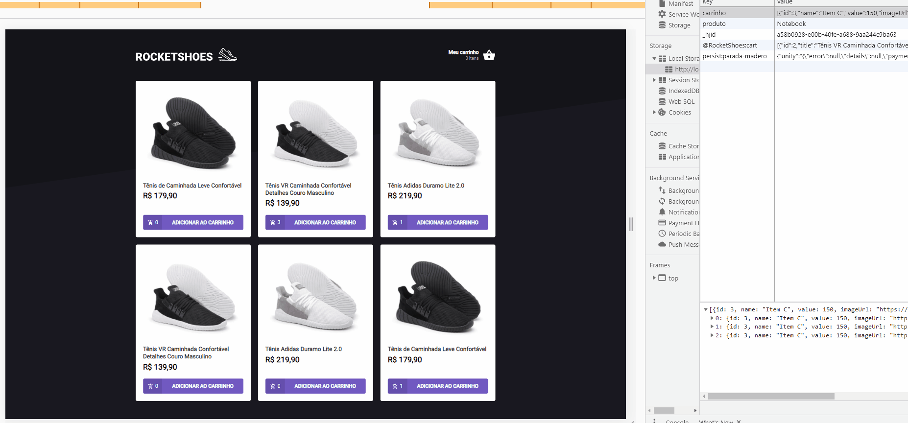

<h1 align="center"> ROCKETSHOES - cart with hooks </h1>

##### Front-end project with React.js, Next.js, TypeScript, Server.js
##### Project developed during the Rocketseat course - [Rocketseat](https://rocketseat.com.br/)
##### Teacher: [Diego Fernandes](https://github.com/diego3g)

<hr/>

### Sumary:
- :rocket: [Description](#rocket-description)
- 👨‍💻️ [Technologies](#%EF%B8%8F-technologies)
- 📦️ [How use](#%EF%B8%8F-how-use)

<hr/>


## :rocket: Description:
A simple tennis e-commerce.
The main objective of this project was to create a shopping cart hook;

##### Functionalities:
* Add a new product to the cart;
* Remove a product from the cart
* Change the quantity of a product in the cart;
* Calculation of the sub-total and total cart prices;
* Inventory validation;
* Display of error messages;
* Others;


---

## 👨‍💻️ Technologies

- [ReactJS](https://reactjs.org/)
- [NextJS]
- [LocalStorage]
- FakeApi with Server.JS
- [TypeScript]
- 100% Teststed 


### IDE

- [Visual Studio Code](https://code.visualstudio.com/)

---

## 📦️ How use

To copy:

```bash
  # Repository clone:
  ❯ git clone https://github.com/TatianaFischer/ignite-cart.git

  # Enter the repository:
  ❯ cd ignite-cart
```

To install the dependencies and start the project, you can use Yarn ou NPM:

** yarn**

```bash
  # Install
  ❯ yarn

  # Inicial
  ❯ yarn start
```

** npm**

```bash
  # Install
  ❯ npm install

  # Inicial
  ❯ npm start
```

To use the fake API with JSON Server:
```
yarn server
```


<p>
---  
  
  
 
--- 
</p>


<h4 align="center">
  Feito por Tatiana Fischer 👋️
 
</h4>
<h4 align="center">
[Linkedin](https://www.linkedin.com/in/tatianaffischer/)
</h4>


